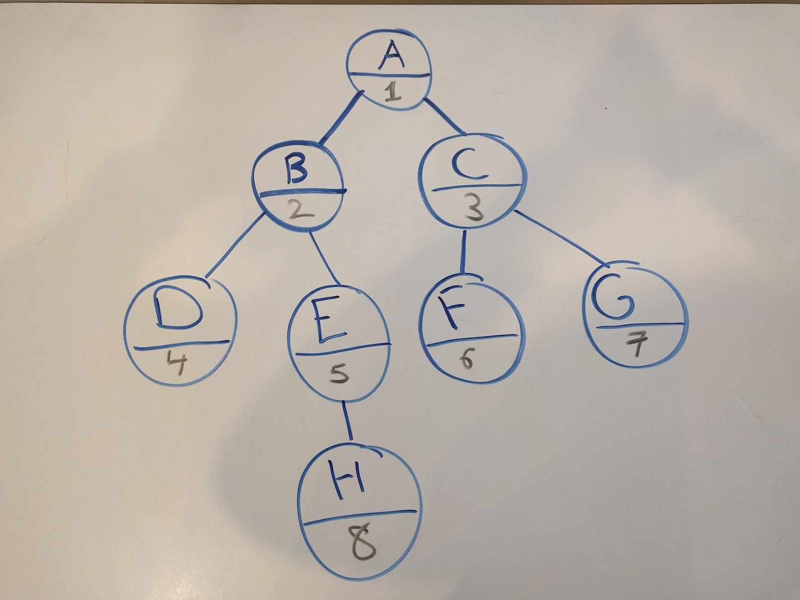

## Breadth First Search ( Trees )

#### What is Breadth First Search?

Breadth First Search (BFS) is a way to search for a value in a Tree or Graph.

Imagine you have 8 nodes. Each of these 8 nodes has a value and each may or may not have some children ( remember that a tree node have have many children. If each root only has 2 children, then it is a *binary tree*). 

Suppose this is true of the 8 nodes:
- Node H exists with value 8. It has no children.
- Node G exists with value 7. It has no children.
- Node F exists with value 6. It has no children.
- Node E exists with value 5. It has one child, the child is Node H.
- Node D exists with value 4. It has no children.
- Node C exists with value 3. It has two children, Node F and Node G.
- Node B exists with value 2. It has two children, Node D and Node E.
- Node A exists with value 1. It has two children, Node B and Node C. This node is the **root** of the tree.

> Check: Take 5 minutes and draw this tree structure out using whiteboards, paper, visual diagrams or text editors.

   
Take a peek at the solution here

      

Breadth First Search (BFS) searches breadth-wise in the problem space. Breadth-First search is like traversing a tree where each node is a state which may a be a potential candidate for solution. It expands nodes from the root of the tree and then generates one level of the tree at a time until a solution is found. It is very easily implemented by maintaining a queue of nodes. Initially the queue contains just the root. In each iteration, node at the head of the queue is removed and then expanded. The generated child nodes are then added to the tail of the queue.

Below, you see an illustration of *Breadth First Search* algorithm on a tree that is *4 levels* deep.
* A node turns gray when we first discover that the node exists and **add it to the queue**.
* A node turns black when we **remove it from the queue**. 

